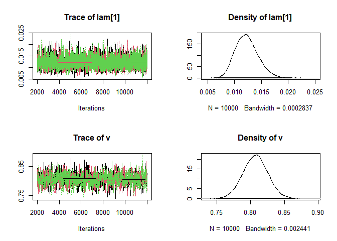
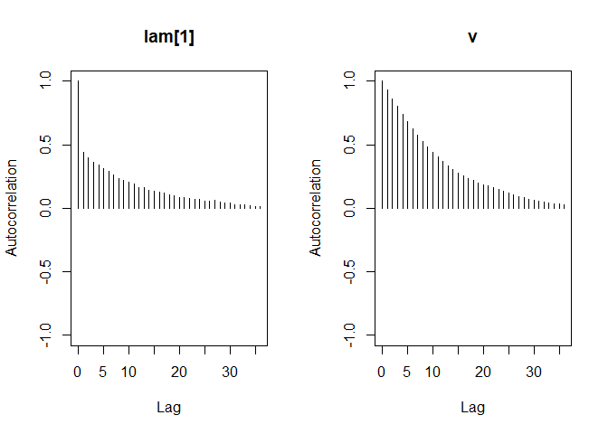

## Abstract

It has been suggested that dwell times on webpages may be modeled using a Weibull distribution, and that Web browsing exhibits a significant "negative ageing" phenomenon, that is, the rate of Webpage abandonment decreases over time [@Liu10]. The goal of this project is to assess the suitability of the normal and Weibull distributions for modeling the average session duration of visitors to a specific website `(http://www.polygraphis.com)`, and to determine whether average session durations for this website have a negative ageing effect. Furthermore, we classify visitors by the region they come from and use a hierarchical Weibull model to study the average session duration of visitors from each region. We then fit the model using JAGS and R and perform convergence diagnostics as well as residual analysis, and assess predictive performance of the model. These results are then compared to those obtained by fitting a normal distribution to the data. 

<p>Our results are as follows. First, it is observed that in both the Weibull and normal models, MCMC convergence of the monitored parameters is achieved after 5000 iterations, and that the corresponding autocorrelation values decrease sharply to 0. Second, the Deviance Information Criterion (DIC) value for the Weibull model turns out to be smaller than that for the normal model. Third, the residual plots for both models do not appear to follow any pattern, but the mean observational level residuals for the normal model are generally lower than those in the Weibull model. That is to say, it appears that the normal model is a better fit to the data than the Weibull model. Fourth, we confirm that the posterior Weibull distribution for each region is indeed negatively ageing, that is, the hazard function for the pdf in each case is decreasing.</p>


## Introduction

The main questions addressed are: first, is the Weibull distribution appropriate for modeling the average session duration of visitors to the website `http://www.polygraphis.com`; second, do average session durations on this website exhibit a negative ageing effect? We propose to analyze the daily average session duration of visitors, classified by geographic region, that arrived at the website via organic search from 6 March 2021 to 12 March 2023. We will apply a hierarchical model to the data, where each region has its own Weibull distribution with a common normal distribution on the shape parameter and a gamma distribution $\Gamma(\alpha,\beta)$ on the scale parameter such that the mean $\frac{\alpha}{\beta}$ and standard deviation $\frac{\sqrt{\alpha}}{\beta}$ are modeled by gamma distributions themselves. Using JAGS and R, we will then fit the model and address the first question by performing convergence diagnostics as well as assessing predictive performance. The second question will be addressed by determining the hazard function of the distribution for each region using the mean parameters of the model obtained.    

## Data

The data were collected from the company's Google Analytics account. The head of the extracted raw dataset is show below.


```
##   Continent     Date Users Avg..Session.Duration
## 1      Asia 20220429    70              00:01:53
## 2      Asia 20220430    65              00:02:16
## 3      Asia 20210514    50              00:01:30
## 4      Asia 20210512    49              00:01:00
## 5      Asia 20220428    42              00:01:29
## 6      Asia 20210420    41              00:01:36
```
The dataset only included organic search traffic. A *session* is defined to be a period of time during which a user interacts with the website; it is initiated when a user that is currently not in any active session views a page,and it ends after 30 minutes of user inactivity, when the user enters the last page without an engagement hit, or at the moment of the last engagement hit on the last page. The *average session duration* for a given date and continent is calculated by dividing the total duration of all sessions on that date of users from the given continent by the corresponding number of sessions [@Google_analytics_avg_session_duration]. The average session durations in the dataset were converted into seconds, and only rows with a well-defined continent (one of the 5 continents - Africa, Americas, Asia, Europe or Oceania) and an average session duration of at least two seconds were kept. Each continent was converted into a number which denoted its position in the lexicographical ordering of all 5 continents (so Africa was mapped to 1, Americas to 2, Asia to 3, Europe to 4 and Oceania to 5). The cleaned dataset had 1128 rows and 2 columns, one for the continent and the other for the average session duration (in seconds). As a side note, we remark that the dwell times considered by [@Liu10] are calculated for single webpages and not for whole sessions.  


```
##   Continent_number average_session_duration
## 1                3                      113
## 2                3                      136
## 3                3                       90
## 4                3                       60
## 5                3                       89
## 6                3                       96
```
Before taking into account the distribution of the average session durations across different regions, we observed that the density line of the data appeared to increase sharply at first, and after reaching its peak seemed to approximately follow a Weibull distribution with negative ageing. The boxplots showed the presence of quite a few outliers for each continent. 

<!-- --><!-- -->

## Model
The Weibull distribution seems to be quite a natural model for dwell times on webpages. The idea is that web users often quickly scan through a webpage for relevance; they abandon it as soon as they discover that it is irrelevant, but are more likely to stay on after the short window for assessing its relevance is over and when they dwell longer on the webpage. The full hierarchical Weibull model is specified in the following code.

```r
mod_string = " model {
for (i in 1:length(Continent)) {
  average_session_duration[i] ~ dweib(v,lam[Continent[i]])
}

for (j in 1:5) {
  lam[j] ~ dgamma(alpha, beta)
  mu[j] = (exp(loggam(1+1/v)))*lam[j]^(-1/v)
}

alpha = mu0^2 / sig0^2
beta = mu0 / sig0^2
v ~ dnorm(3.0,1.0)

mu0 ~ dgamma(.1, 10.0)
sig0 ~ dgamma(.1,10.0)

} "
```
We postulated that the daily average session duration for visitors from each continent $i$ follows a Weibull distribution with shape parameter $v \sim N(3.0,1.0)$ and scale parameter $\lambda_i \sim \Gamma(\alpha,\beta)$, where the mean $\mu_0 = \frac{\alpha}{\beta}$ and standard deviation $\sigma_0 = \frac{\sqrt{\alpha}}{\beta}$ both follow a gamma distribution, in particular $\frac{\alpha}{\beta} \sim \Gamma(0.1,10.0)$ and $\frac{\sqrt{\alpha}}{\beta} \sim \Gamma(3.0,2.5)$. The parameters $a,b,a',b'$ for the distributions $\Gamma(a,b)$ and $\Gamma(a',b')$ of $\mu_0$ and $\sigma_0$ respectively were chosen after simulating draws from prior distributions for different values of $a,b,a',b'$ between $0$ and $10$. The mean $\mu_i$ of the Weibull distribution with shape parameter $v$ and scale parameter $\lambda_i$ was calculated using the formula $\mu_i = \Gamma(1+\frac{1}{v})\cdot \lambda_i^{-\frac{1}{v}}$; here $\Gamma$ denotes the gamma function. Further, we note that when the shape parameter $v$ is known, the conjugate prior of the likelihood function of $\lambda_i$ conditioned on a set of data points is a gamma distribution [@Fink97]; thus the gamma distribution was chosen as the prior distribution for the scale parameter. Another reason for choosing the gamma distribution is to ensure that the values of the scale parameter are always positive; otherwise, the Weibull pdf for the average session duration might be undefined. Based on the mean estimates of the model parameters $\lambda_i$ and $v$ for each continent $i$, the first question of this project could be addressed by calculating the mean residuals for each continent $i$. The second question could be addressed by determining, for each continent $i$, whether or not the hazard function $h(t) = v\lambda_it^{v-1}$ is decreasing; if so, then this would confirm the negative ageing effect of average session durations, and otherwise it would suggest that positive ageing is observed instead.

Having specified the model, we set a seed of 113 and fitted the model using JAGS and R. The monitored parameters were $v$, $\mu$, $\lambda$, $\mu_0$ and $\sigma_0$ ($\mu$ and $\lambda$ are vectors of length 5, where each coordinate corresponds to a continent). The algorithm was run for three chains with a burn-in period of 1000 iterations, and each chain was run for 1e4 iterations. It was observed that convergence for each parameter was achieved after 1e4 iterations. The Gelman-Rubin diagnostic potential reduction factor for every parameter except $\mu_0$ and $\sigma_0$ also converged to $1$; the shrink factor for $\mu_0$ reduced to between 1.03 and 1.09 while that for $\sigma_0$ reduced to between 1.07 and 1.15. The trace, density and autocorrelation plots for $\lambda_1$ and $v$ (for all three chains) are shown below.   


<!-- --><!-- --><!-- --><!-- -->

We also calculated a value of 12848 for the Deviance Information Criterion (DIC); this value would later be compared to the DIC value obtained for the alternative, normal model. 

In order to carry out residual analysis, we divided all the daily average session durations into 5 sublists, one for each of the 5 continents, and subtracted the mean average session duration $\mu_i$ for each continent $i$ from every element in the corresponding sublist for continent $i$. The residual plots are shown below.   

<!-- -->

The mean as well as the standard deviation of the residuals for the 5 continents are listed below in ascending order of the continent indices. 


```
## Mean residuals: 6.7456 3.210117 -2.748751 19.64922 -21.32905
```

```
## Standard deviation of residuals: 327.9693 144.0456 127.6912 501.8171 99.26842
```

Apart from the presence of outliers, there did not appear to be any unusual patterns in the residual plots. We also compared the continent average session duration means to the overall mean average session duration. The latter was calculated using the formula $\mu = \Gamma(1+\frac{1}{v})\cdot\mu_0^{-\frac{1}{v}}$; here $\mu_0$ denotes the overall mean of the scale parameter $\lambda$. 
The plot of the differences $\mu_i - \mu$ for $i \in \{1,2,3,4,5\}$ is shown below.

<!-- -->

We also used the posterior samples to get Monte Carlo estimates of the mean average session duration. This was done by drawing $3e4$ samples of the scale parameter $\lambda$ from the gamma distribution with shape $\frac{\mu_0^2}{\sigma_0^2}$ and rate $\frac{\mu_0}{\sigma_0^2}$ (thus taking into account the uncertainty in the parameters $\alpha$ and $\beta$), then, for the $j$-th sample $\lambda(j)$ drawn, calculating the corresponding mean $\lambda(j)^{-\frac{1}{v_j}}\cdot\Gamma(1+\frac{1}{v_j})$, where $v_j$ is the $j$-th sample drawn from the distribution $N(3,1)$. Quantiles of the estimates, ranging from 0% to 100% in intervals of 5%, are shown below. While the 95% quantile of the simulated distribution was approximately 650.8, there were a number of extreme outliers (the maximum value being 7.238549e14), resulting in the mean being unrealistically large (24128943778). We would thus suggest using the median of 147.4 (correct to 1 decimal place) as a measure of central tendency. In addition, we used the 3e4 samples of $\mu_0$ (the mean of the distribution of the scale parameter $\lambda$) to simulate the average  session duration for a new continent; the histogram of the simulated posterior predictive distribution is shown below.


```
##           0%           5%          10%          15%          20%          25% 
## 2.024426e+00 5.035039e+01 6.479379e+01 7.679248e+01 8.722426e+01 9.669675e+01 
##          30%          35%          40%          45%          50%          55% 
## 1.060290e+02 1.154505e+02 1.248197e+02 1.354065e+02 1.461793e+02 1.579984e+02 
##          60%          65%          70%          75%          80%          85% 
## 1.716290e+02 1.875620e+02 2.064360e+02 2.320105e+02 2.648734e+02 3.167635e+02 
##          90%          95%         100% 
## 4.063484e+02 6.638312e+02 1.771012e+14
```

<!-- -->

For comparison, we tried fitting an alternative model to the data using the normal distribution. The mean and precision were modeled using gamma distributions. The mean and standard deviation of the parameters of the mean distribution were also modeled using gamma distributions.


```r
mod1_string = " model {
for (i in 1:length(Continent)) {
  average_session_duration[i] ~ dnorm(mu[Continent[i]],prec[Continent[i]])
}

for (j in 1:5) {
  mu[j] ~ dgamma(alpha, beta)
  prec[j] ~ dgamma(50.0, 5*1.0/2.0)

}

alpha = mu0^2 / sig0^2
beta = mu0 / sig0^2
sig = 1/sqrt(prec)

mu0 ~ dgamma(124.0, 1.0)
sig0 ~ dgamma(50.0,1/10.0)


} "
```

As was the case for the Weibull model, convergence was observed after 1e4 iterations. However, it was observed that even though the DIC value for the normal model was 14821 - larger than the DIC value of 12848 for the Weibull model, the mean residuals were smaller in the normal model, as shown below. 


```
## Mean residuals: 2.710376 0.5501907 0.2144954 5.041632 0.7909642
```

```
## Standard deviation of residuals: 327.9693 144.0456 127.6912 501.8171 99.26842
```

The posterior samples were again drawn to get Monte Carlo estimates of the mean average session duration. In comparison to the Weibull model, the range of values of the samples of the mean drawn for the normal model seemed to be more reasonable (lying between 0 and 9.051076e3). Using these samples, we simulated the distribution of the  average session duration (thus taking into account the uncertainty in the mean average session duration).  


```
##           0%           5%          10%          15%          20%          25% 
## 1.295984e-63 4.340635e-12 1.969322e-08 2.154042e-06 5.126770e-05 6.465336e-04 
##          30%          35%          40%          45%          50%          55% 
## 4.697776e-03 2.423898e-02 9.779947e-02 3.353844e-01 9.990864e-01 2.555149e+00 
##          60%          65%          70%          75%          80%          85% 
## 6.014731e+00 1.315230e+01 2.631249e+01 5.220144e+01 9.817213e+01 1.850762e+02 
##          90%          95%         100% 
## 3.592999e+02 7.677039e+02 7.630786e+03
```

<!-- -->

## Results and Conclusions

The following is the summary of the posterior distribution for the Weibull model.

```
## 
## Iterations = 1:30000
## Thinning interval = 1 
## Number of chains = 1 
## Sample size per chain = 30000 
## 
## 1. Empirical mean and standard deviation for each variable,
##    plus standard error of the mean:
## 
##             Mean        SD  Naive SE Time-series SE
## lam[1]   0.01228  0.002079 1.201e-05      4.142e-05
## lam[2]   0.03154  0.003208 1.852e-05      8.851e-05
## lam[3]   0.02497  0.002446 1.412e-05      6.877e-05
## lam[4]   0.01285  0.001845 1.065e-05      4.379e-05
## lam[5]   0.02460  0.006289 3.631e-05      7.923e-05
## mu[1]  271.03622 45.246642 2.612e-01      2.767e-01
## mu[2]   82.31119  5.163291 2.981e-02      3.031e-02
## mu[3]  109.82412  5.898666 3.406e-02      3.378e-02
## mu[4]  253.19560 29.311352 1.692e-01      1.738e-01
## mu[5]  121.04334 38.219823 2.207e-01      2.454e-01
## mu0      0.02256  0.007414 4.280e-05      2.579e-04
## sig0     0.01179  0.008570 4.948e-05      3.169e-04
## v        0.80700  0.017671 1.020e-04      5.336e-04
## 
## 2. Quantiles for each variable:
## 
##             2.5%       25%       50%       75%     97.5%
## lam[1] 8.649e-03 1.081e-02 1.212e-02   0.01359   0.01674
## lam[2] 2.569e-02 2.931e-02 3.140e-02   0.03359   0.03825
## lam[3] 2.044e-02 2.327e-02 2.487e-02   0.02656   0.03008
## lam[4] 9.535e-03 1.155e-02 1.273e-02   0.01402   0.01676
## lam[5] 1.417e-02 2.016e-02 2.397e-02   0.02834   0.03854
## mu[1]  1.969e+02 2.389e+02 2.661e+02 297.54176 373.14525
## mu[2]  7.283e+01 7.873e+01 8.212e+01  85.67507  92.95117
## mu[3]  9.882e+01 1.058e+02 1.096e+02 113.65826 121.82041
## mu[4]  2.017e+02 2.326e+02 2.509e+02 271.45022 316.73872
## mu[5]  6.586e+01 9.426e+01 1.146e+02 140.68540 212.90638
## mu0    1.297e-02 1.828e-02 2.142e-02   0.02523   0.03869
## sig0   4.823e-03 7.372e-03 9.664e-03   0.01337   0.03114
## v      7.725e-01 7.950e-01 8.070e-01   0.81875   0.84231
```

Here is the summary of the posterior distribution for the normal model.


```
## 
## Iterations = 1:30000
## Thinning interval = 1 
## Number of chains = 1 
## Sample size per chain = 30000 
## 
## 1. Empirical mean and standard deviation for each variable,
##    plus standard error of the mean:
## 
##          Mean     SD Naive SE Time-series SE
## mu[1]  275.07 26.568  0.15339        0.19527
## mu[2]   84.97  6.543  0.03778        0.04835
## mu[3]  106.86  5.007  0.02891        0.03673
## mu[4]  267.80 34.547  0.19946        0.24982
## mu[5]   98.92  9.088  0.05247        0.06604
## mu0    132.11 11.446  0.06608        0.08474
## sig[1] 195.22 11.238  0.06488        0.06577
## sig[2] 128.91  4.080  0.02355        0.02355
## sig[3] 117.48  3.265  0.01885        0.01859
## sig[4] 368.21 17.890  0.10329        0.09914
## sig[5]  33.89  2.277  0.01315        0.01335
## sig0   421.82 63.597  0.36718        0.47980
## 
## 2. Quantiles for each variable:
## 
##          2.5%    25%    50%    75%  97.5%
## mu[1]  222.13 257.27 275.08 293.11 326.81
## mu[2]   72.17  80.56  85.00  89.35  97.85
## mu[3]   96.90 103.53 106.86 110.25 116.51
## mu[4]  199.66 244.43 267.94 291.39 334.82
## mu[5]   81.15  92.83  98.86 105.03 116.90
## mu0    110.67 124.19 131.69 139.73 155.39
## sig[1] 174.85 187.37 194.71 202.50 218.94
## sig[2] 121.27 126.11 128.82 131.60 137.21
## sig[3] 111.32 115.23 117.41 119.65 124.08
## sig[4] 335.52 355.78 367.39 379.82 405.83
## sig[5]  29.78  32.28  33.76  35.32  38.69
## sig0   307.08 377.04 418.69 462.67 555.65
```

The mean values of the posterior average session durations for each of the 5 continents in the Weibull model appeared to be fairly similar to the corresponding values in the normal model. However, while the residual errors for the normal model were smaller than those for the Weibull model, the DIC value of 12484 for the Weibull model  was smaller than the DIC value of 14821 for the normal model, suggesting that the Weibull model may be preferable to the normal model. 

Finally, the second question of this project may be answered by looking at the mean value of the shape parameter $v$ as well as the mean value of the scale parameter $\lambda_i$ ($i \in \{1,2,3,4,5\}$) for each of the 5 continents. The hazard function of the Weibull distribution with shape parameter $v$ and scale parameter $\lambda$ is given by $h(t) = v\lambda_it^{v-1}$, and $h(t)$ is a positive decreasing function iff $v < 1$ and $\lambda_i > 0$. The plots below show that the hazard functions for all 5 distributions are indeed decreasing, thus confirming the phenomenon of negative ageing.

<!-- -->

As briefly mentioned earlier, one caveat is that the Weibull model we fitted has quite a number of outliers. Furthermore, a limitation of the model is that the shape parameter $v$ follows a normal distribution with fixed parameters. It might be reasonable to allow the parameters of the distribution of $v$ to have distributions themselves, thus reflecting the variability of the mean values of $v$ for the different continents. Another possible improvement is to consider fitting a mixed model, for example a mixture of two Weibull distributions, which might reduce the residual errors.       

## References
